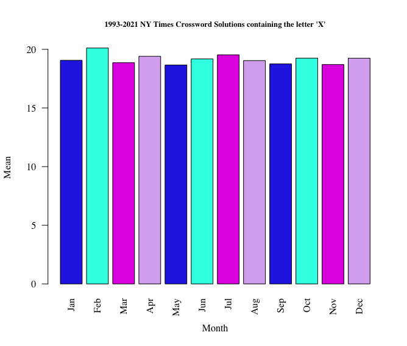
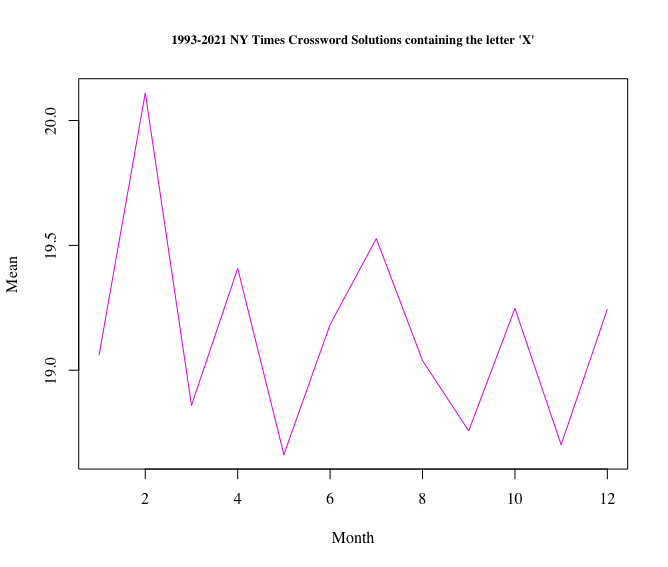
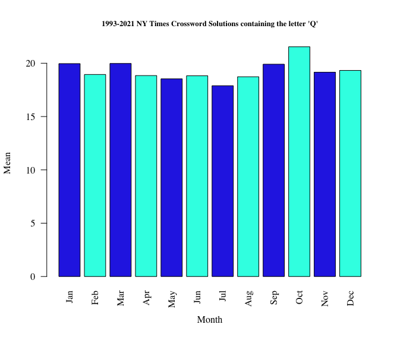
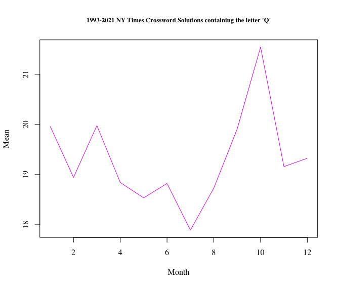
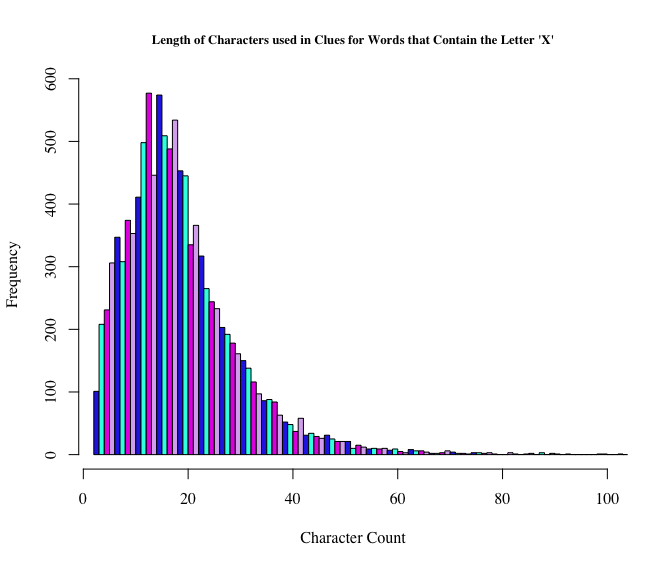
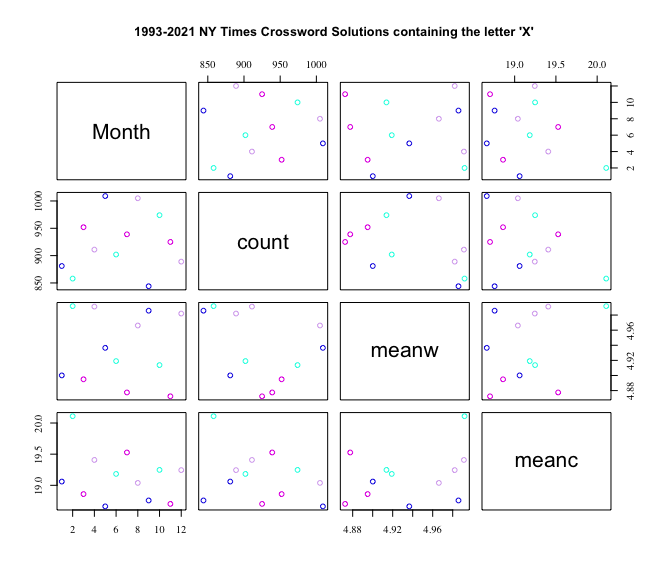
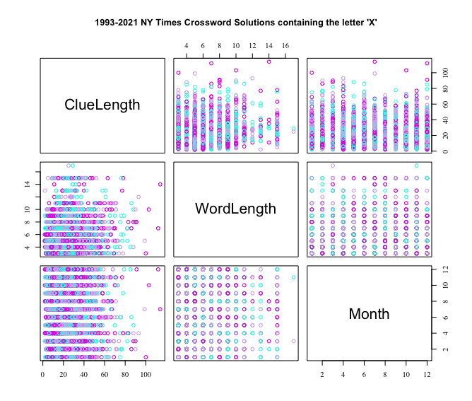

Homework 6: Initial Dataset Exploration
================
Peter Mavronicolas
11/13/2021

### Step 1: Choose a Dataset

**My interest in the topic**

I chose the topic of New York Times Crossword Puzzle Dataset because I
myself had written crossword puzzles while developing Crossword AR
(Augmented Reality) for iOS. While searching YouTube videos on how to
make a crossword puzzle, the very first video in my search was of David
Kwong, a New York Times Cruciverbalist or constructor of crossword
puzzles. David went through the intricacies that go into making a
crossword puzzle; always making sure the rules of puzzle making were
respected. The beginning of any crossword is very simple but I learned
as I progressed through filling in the words, I found myself desperately
applying abbreviations, acronyms, and even words in foreign languages
(foreshadowing). To my relief, I found a website that charged around $5
per month to generate crossword puzzles based on a set of words that I
inputed into the program.

**The Result**

I finally launched Crossword AR, an Augmented Reality game where users
could scroll through clues and select letters that appear to fall out of
the sky and onto the puzzle board. Due to a vigorous schedule between
work, school and family, I’ve neglected updating the application but
look forward to working on the source code over the holiday break.

**Data Source Link**

     Kaggle, https://www.kaggle.com/darinhawley/new-york-times-crossword-clues-answers-19932021?select=nytcrosswords.csv

**Link to the Original Source of the Data**

There isn’t any information connecting an original data source in Kaggle
which may be attributed to plagiarism accusations amde by the New York
Times. The New York Times posted an article by Eli Rosenberg that states
USA Today along with Universal Crosswords plagiarized crossword puzzles
originally created by the New York Times. The database in question can
be found at <http://xd.saul.pw/xdiffs/>. This dataset references a
github repository located at <https://github.com/century-arcade/xd>. In
conclusion, the original data source has not been identified on Kaggle
and the only presumable original data source is more than likely owned
and stored by the New York Times.

### Step 2: Start the EDA Process

**Questions**

-   What month of the year are words that contain the letter ‘X’ used
    the most in Crosswords?
-   What month of the year are words that contain the letter ‘Q’ used
    the most in Crosswords?

After downloading the initial dataset and making the necessary additions
of columns along with summation and mean calculations, I was able to
produce additional questions?

-   Why is the letter “X” used at a higher rate in the month of
    February?

-   Why is the letter “Q” used at a higher rate in the month of October?

**Data Cleaning**

I began by downloading the file from Kaggle and importing the dataset
into R Studio with the following code:

     CROSSWORD <- read.csv("nytcrosswords.csv",stringsAsFactors = FALSE)

This line of code was later updated after making further changes using
Open Refine which will be discussed later in this report.

    CROSSWORD <- read.csv("nytcrosswords-csv2.csv",stringsAsFactors = FALSE)

Next, I used the grep function to filter by letter. The first letter
filtered from the word columns is ‘X’.

     XWORDS <- grep("X", CROSSWORD$Word, fixed = TRUE)

The filtered data, “XWORDS”, is then used to make a new dataset named
“CROSSWORD.SS”.

     CROSSWORD.SS <- CROSSWORD[XWORDS,]

I proceeded to convert the “m/d/y” dates to numeric months (1,2,3,etc.)
and created a new column, “Month”, in the “CROSSWORD.SS” dataset. The
lubridate library was installed and the mdy function was accessed.

     CROSSWORD.SS$Month <- month(mdy(CROSSWORD.SS$Date))

The nchar function was used to create two more columns in
“CROSSWORD.SS”; “WordLength” and “ClueLength”.

     CROSSWORD.SS$WordLength <- nchar(CROSSWORD.SS$Word)
     CROSSWORD.SS$ClueLength <- nchar(CROSSWORD.SS$Clue)

The numeric months (1-12) were then grouped together.

     CROSSWORD.GP <- group_by(CROSSWORD.SS, Month)

Calculations were performed to find the sum of “Month” along with the
means for “WordLength” and “ClueLength”.

     CROSSWORD.GP <- summarize(CROSSWORD.GP, count=sum(Month==Month), meanw=mean(WordLength), meanc=mean(ClueLength))

The following steps were then repeated for the letter ‘Q’.

     QWORDS <- grep("Q", CROSSWORD$Word, fixed = TRUE)
     CROSSWORD.SSQ <- CROSSWORD[QWORDS,]
     CROSSWORD.SSQ$Month <- month(mdy(CROSSWORD.SSQ$Date))
     CROSSWORD.SSQ$WordLength <- nchar(CROSSWORD.SSQ$Word)
     CROSSWORD.SSQ$ClueLength <- nchar(CROSSWORD.SSQ$Clue)
     CROSSWORD.GPQ <- group_by(CROSSWORD.SSQ, Month)
     CROSSWORD.GPQ <- summarize(CROSSWORD.GPQ, count=sum(Month==Month), meanw=mean(WordLength), meanc=mean(ClueLength))

**Problems Filtering Data**

I ran into compiler errors when trying to run the following code:

     CROSSWORD.SSQ$ClueLength <- nchar(CROSSWORD.SSQ$Clue)

*Text Edit*

After further investigation of the file “nytcrosswords.csv” using
TextEdit, the line in question (188) containing the word “SEXT” had the
French letters “É” used in the clue containing the words “COMMUNIQUÉ”
and “RISQUÉ”. The letters were replaced with the English “E”. After
recompiling, another error occurred a few lines later. This time a
symbol was found and deleted. After the third recompilation and error, I
decided to use Open Refine to fix the problem.

*Open Refine*

In Open Refine, I imported the dataset I had been using in R Studio.
When creating a project, in the settings pane at the bottom of the
screen, I selected ASCI II and saved the project. The line of code that
previously created errors now compiled as expected with no further
issues.

*Failed Attempts*

It should be mentioned that I also attempted to apply the following code
to the original code causing the compiler errors without success:

      scan(what="",allowEscapes=FALSE)
      stri_length(stri_enc_toutf8

**Visualization Idioms**

In order to visualize the graphs and charts, the following libraries
were installed and accessed:

     library(tidyverse)
     library(lubridate)
     library(textclean)
     library(stringi)
     library(ggplot2)

After the datasets were prepared, I began to visualize the mean
occurrence (meanc) for clues containing the letter “X” in the
“CROSSWORD.GP” dataset. I used a barplot function with the following
code:

     barplot(CROSSWORD.GP$meanc,col = c("#2B35E5", "#2BFFE5", "#E335E5", "#d9b1f0"), xlab= "Month", ylab="Mean",  
     names.arg=month.abb[1:12],las=2, main="1993-2021 NY Times Crossword Solutions containing the letter 'X'", 
     cex.main=0.8, family = "serif")

In the bar plot above, I noticed an increase in the usage of wors that
contained the letter “X” in the month of Februrary. Next, I attempted to
reproduce the same idiom above as a line plot using the following code:

     plot(CROSSWORD.GP$meanc, type ="l", col = c("#E335E5"), xlab="Month", ylab="Mean",main="1993-2021 NY Times 
     Crossword Solutions containing the letter 'X'", cex.main=0.8, family = "serif")

I wanted to inquire about the same mean occurrence of clues with the
letter “Q” by using the following code:

     barplot(CROSSWORD.GPQ$meanc, col = c("#2B35E5", "#2BFFE5"), xlab="Month", ylab="Mean", 
     names.arg=month.abb[1:12],las=2, main="1993-2021 NY Times Crossword Solutions containing the letter 'Q'", 
     cex.main=0.8, family = "serif")

In the bar plot for“Q”, I noticed an increase in the usage of words that
contain the letter “Q” in the month of October. Again, further
exploration brought me to reproduce the same idiom above for the letter
“Q” as a line plot using the following code:

     plot(CROSSWORD.GPQ$meanc, type ="l", col = c("#E335E5"), xlab="Month", ylab="Mean", main="1993-2021 NY Times 
     Crossword Solutions containing the letter 'Q'", cex.main=0.8, family = "serif")

Next, I shifted my visualization to a histogram showing the character
count by month of each clue containing the letter “X”:

     hist(CROSSWORD.SS$ClueLength, main="Length of Characters used in Clues for Words that Contain the Letter 
     'X'",xlab="Character Count", ylab="Frequency", xlim=c(3,100),col = c("#2B35E5", "#2BFFE5", "#E335E5", "#d9b1f0"), 
     breaks = 100,cex.main=0.8, family = "serif")

I also tried out a Boxplot with little success in rendering any useful
information to the user. I then moved on to visualizing a Correlation
plot which did not seem to show any significant correlations. It did,
however, capture all of the data from the dataset “CROSSWORD.GP” for
“month”, “count”, “meanw” and “meanc”.

     pairs(CROSSWORD.GP,col = c("#2B35E5", "#2BFFE5", "#E335E5", "#d9b1f0"), main="1993-2021 NY Times Crossword 
     Solutions containing the letter 'X'", cex.main=0.8, family = "serif")

A second correlation plot was visualized comparing “WordLength”,
“ClueLength” and “Month”.

     pairs(~ ClueLength + WordLength + Month, data = CROSSWORD.SS, col = c( "#2BFFE5", "#E335E5", "#d9b1f0"), 
     main="1993-2021 NY Times Crossword Solutions containing the letter 'X'", cex.main=0.8, family = "serif")

**Observations**

I observed that vowels are consistently used throughout Crossword
puzzles regardless of the month of the year. I identified the only major
variations in the words themselves to be length. It seems as though the
majority of letter usage was determined by random chance as chosen by
the cruciverbalist during the creation of the puzzle.

**Interest Findings**

Crossword clues certainly had a noticeable mean where the majority of
data points on the histogram peaked between 8 and 16 characters. The
letter “Q” was used at a greater rate in the month of October and “X”
was used at a greater rate in the month of February.

**Full Explanation of Analysis**

I attribute the peak number of characters in clue length (8-16) to the
limitations of the newspaper margins that the Cruciverbalist is granted.
In order to determine why the letter “X” was used more in February than
other months, I created an additional dataset “CROSSWORD.XO”, sorted by
Date and noticed that the Cruciverbalist used words containing “XO” as a
theme in the month of February; both before and after Valentine’s Day.

     XOWORDS <- grep("XO", CROSSWORD$Word, fixed = TRUE)
     CROSSWORD.XO <- CROSSWORD[XOWORDS,]
     CROSSWORD.XO$Month <- month(mdy(CROSSWORD.XO$Date))
     CROSSWORD.XO$WordLength <- nchar(CROSSWORD.XO$Word)
     CROSSWORD.XO$ClueLength <- nchar(CROSSWORD.XO$Clue)
     
     CROSSWORD.GPXO <- group_by(CROSSWORD.XO, Month)
     CROSSWORD.GPXO <- summarize(CROSSWORD.GPXO, count=sum(Month==Month), meanw=mean(WordLength), meanc=mean(ClueLength))

This may have been done unknowingly by the Cruciverbalist while
brainstorming in anticipation of the upcoming holiday. I also queried
through the words that contained the letter “Q” in the month of October
and found it quite difficult to acquire any significant reason why “Q”
was used more frequently but I haven’t quit thinking about the question.

**References**

-   How to Make a Crossword Puzzle,
    <https://www.youtube.com/watch?v=aAqQnXHd7qk>
-   Crossword AR for iOS,
    <https://apps.apple.com/us/app/crossword-ar/id1489422137>
-   Kaggle,
    <https://www.kaggle.com/darinhawley/new-york-times-crossword-clues-answers-19932021?select=nytcrosswords.csv>  
-   grep,
    <https://www.rdocumentation.org/packages/base/versions/3.6.2/topics/grep>
-   Lubridate,
    <https://cran.r-project.org/web/packages/lubridate/index.html>
-   Text Clean,
    <https://cran.r-project.org/web/packages/textclean/index.html>
-   Escape Operator Troubleshooting,  
    <https://stackoverflow.com/questions/4685737/ignore-escape-characters-backslashes-in-r-strings>
-   Adjust font Size,
    <https://stackoverflow.com/questions/4241798/how-to-increase-font-size-in-a-plot-in-r>
-   French Letter ‘É’, <https://en.wikipedia.org/wiki/%C3%89>
-   Crosswords Seemingly Copied from New York Times,
    <https://www.nytimes.com/2016/03/06/business/media/questions-raised-over-crosswords-seemingly-copied-from-the-new-york-times.html>
-   Change Font in R,
    <https://cran.r-project.org/web/packages/svglite/vignettes/fonts.html>
-   Install Packages,
    <https://www.r-bloggers.com/2010/11/installing-r-packages/>
-   Months on x-axis Instead of Numbers,
    <https://stackoverflow.com/questions/58209870/months-on-x-axis-instead-of-number>
-   Correlation Plot, <https://r-coder.com/correlation-plot-r/>
-   Kaggle,
    <https://www.kaggle.com/darinhawley/new-york-times-crossword-clues-answers-19932021?select=nytcrosswords.csv>
